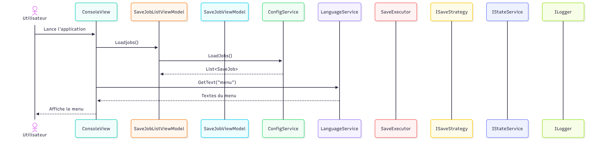
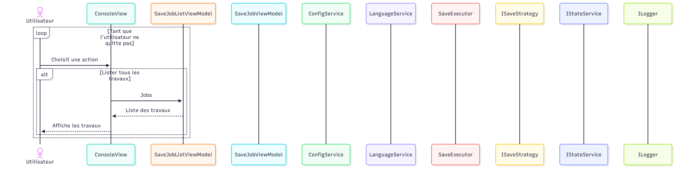
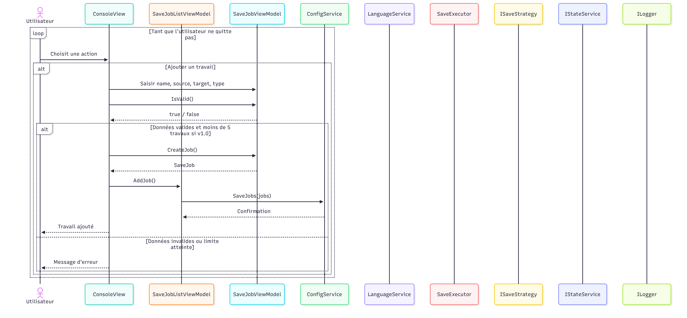
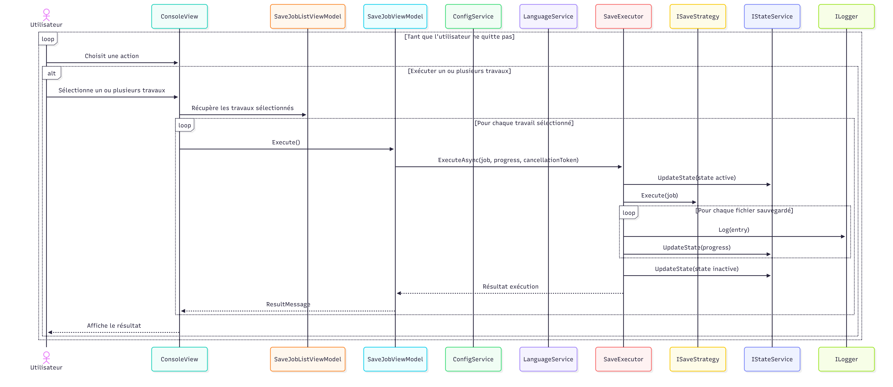
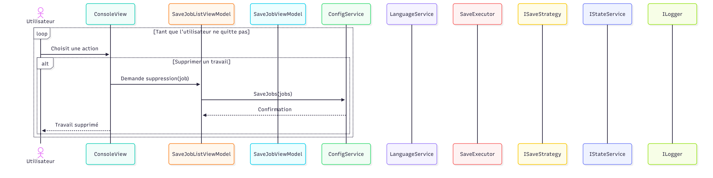
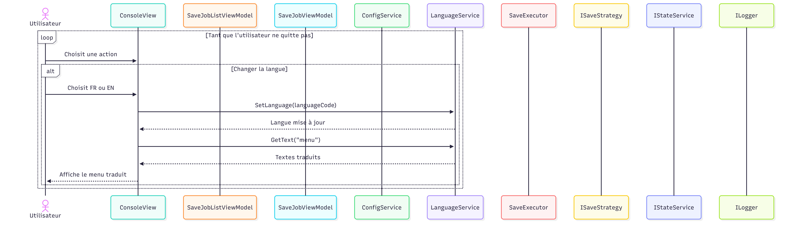

# Diagrammes de séquence

Cette page regroupe les diagrammes de séquence UML détaillant les interactions entre composants pour chaque scénario fonctionnel de l'application (v1.0 / v1.1).

---

## Vue d'ensemble

---

## Démarrage de l'application

---

## Lister les travaux

---

## Ajouter un travail

---

## Exécuter un travail

---

## Supprimer un travail

---

## Changer de langue

