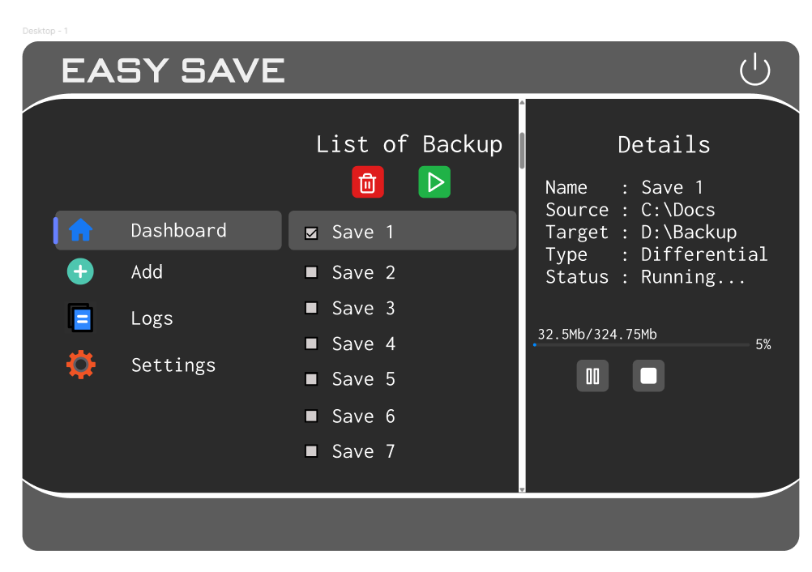
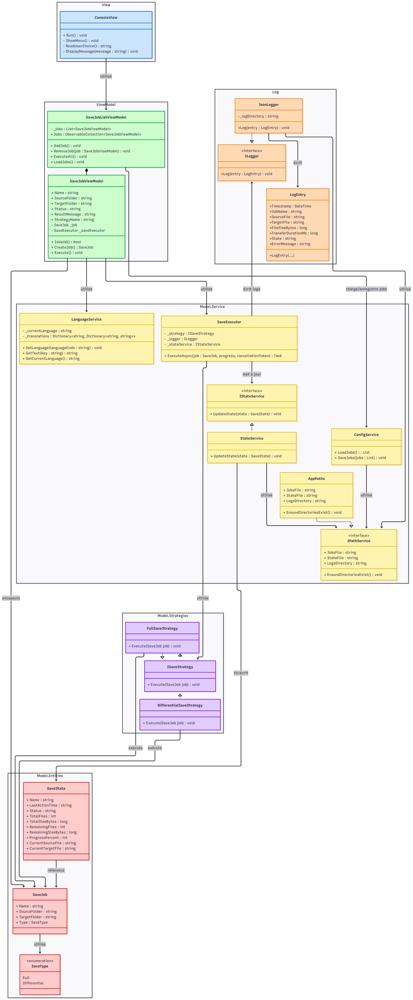
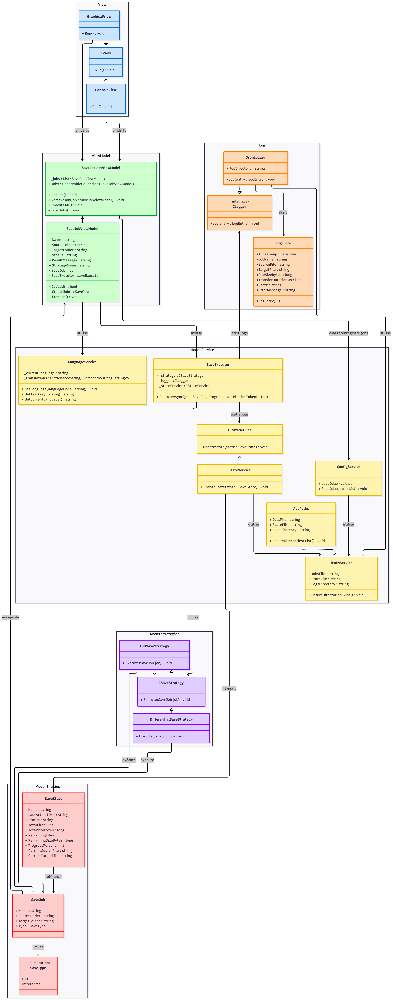

# v1.0 — Application Console

**Date de livraison :** Livrable 1  
**Statut :** ✅ Livré  
**Interface :** Console (.NET 8.0)

---

## Fonctionnalités

- **5 travaux de sauvegarde** maximum (complète ou différentielle)
- **Bilingue** FR / EN — détection automatique de la locale système
- **Exécution** par menu interactif ou argument CLI
- **Log journalier** JSON via `EasyLog.dll`
- **État temps réel** dans `state.json`
- **Destinations** : disques locaux, disques externes, lecteurs réseau

### Arguments CLI

```bash
EasySave.exe          # menu interactif
EasySave.exe 1-3      # exécute les travaux 1 à 3
EasySave.exe 1;3      # exécute les travaux 1 et 3
```

### Menu interactif

```
1. Lister les travaux
2. Ajouter un travail
3. Exécuter un ou plusieurs travaux
4. Supprimer un travail
0. Quitter
```

---

## Architecture

```
EasySave.Console/
└── ConsoleView.cs      Menu, saisies utilisateur, affichage

EasySave.Core/
├── Models/
│   ├── SaveJob.cs      Définition d'un travail (nom, source, cible, type)
│   ├── SaveState.cs    État d'avancement en temps réel
│   └── SaveType.cs     Enum : Full | Differential
└── Services/
    ├── SaveExecutor.cs Orchestration de l'exécution
    ├── ConfigService.cs Lecture/écriture de jobs.json
    ├── StateService.cs  Lecture/écriture de state.json
    └── AppPaths.cs      Centralise tous les chemins de fichiers

EasyLog/
└── JsonLogger.cs       Écriture des logs journaliers JSON
```

---

## Modèle de données

### Travail de sauvegarde (`SaveJob`)

| Champ | Type | Description |
|---|---|---|
| `Name` | `string` | Identifiant unique du travail |
| `SourceFolder` | `string` | Répertoire source |
| `TargetFolder` | `string` | Répertoire cible |
| `Type` | `SaveType` | `Full` ou `Differential` |

### Entrée de log (`LogEntry`)

```json
{
  "Timestamp": "2026-04-23T10:00:00Z",
  "JobName": "backup-docs",
  "SourceFile": "D:\\Documents\\rapport.txt",
  "TargetFile": "E:\\Sauvegardes\\docs\\rapport.txt",
  "FileSizeBytes": 4096,
  "TransferDurationMs": 12,
  "EncryptionTimeMs": 0
}
```

> `TransferDurationMs` négatif = erreur lors du transfert.

---

## Sauvegarde complète vs différentielle

| | Complète | Différentielle |
|---|---|---|
| **Quoi copier** | Tous les fichiers | Fichiers absents ou modifiés depuis la dernière copie |
| **Critère** | — | Date modification source > destination **ou** taille différente |
| **Usage** | Premier lancement | Sauvegardes régulières |

---

## Fichiers générés

| Fichier | Chemin | Description |
|---|---|---|
| Travaux | `%AppData%\EasySave\jobs.json` | Configuration des travaux |
| État | `%AppData%\EasySave\state.json` | Progression temps réel |
| Log | `%AppData%\EasySave\logs\YYYY-MM-DD.json` | Historique par fichier |

---

## Limites connues

- Maximum 5 travaux (levé en [v2.0](v2.0.md))
- Interface console uniquement (WPF en [v2.0](v2.0.md))
- Exécution séquentielle uniquement (parallèle en [v3.0](v3.0.md))
- Pas de cryptage (ajouté en [v2.0](v2.0.md))

---

## Diagrammes

### Interface console



### Diagramme de classes



### Diagramme de classes détaillé



### Diagramme de séquence


→ Voir aussi la [page Diagrammes de séquence](../architecture/diagrams.md) pour tous les scénarios détaillés.
