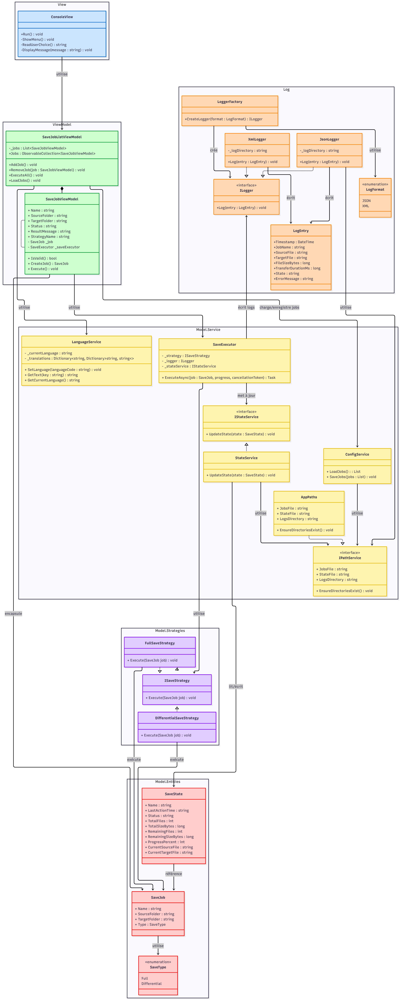

# v1.1 — XML Logger & LoggerFactory

**Date de livraison :** Livrable 2 (avec v2.0)  
**Statut :** ✅ Livré  
**Interface :** Console (même que v1.0)

---

## Contexte

Un client important a refusé de passer à la v2.0. ProSoft a donc livré une évolution mineure de l'application console avec le choix du format de log.

---

## Nouveautés par rapport à v1.0

### 1. Format de log configurable (JSON ou XML)

L'utilisateur peut choisir le format de ses logs journaliers dans les **Paramètres** (option 6 du menu).  
La préférence est sauvegardée dans `settings.json`.

=== "JSON (défaut)"
    ```json
    {
      "Timestamp": "2026-05-11T14:00:00Z",
      "JobName": "backup-docs",
      "SourceFile": "D:\\Documents\\rapport.txt",
      "TargetFile": "E:\\Sauvegardes\\rapport.txt",
      "FileSizeBytes": 4096,
      "TransferDurationMs": 8,
      "EncryptionTimeMs": 0
    }
    ```

=== "XML"
    ```xml
    <LogEntry>
      <Timestamp>2026-05-11T14:00:00Z</Timestamp>
      <JobName>backup-docs</JobName>
      <SourceFile>D:\Documents\rapport.txt</SourceFile>
      <TargetFile>E:\Sauvegardes\rapport.txt</TargetFile>
      <FileSizeBytes>4096</FileSizeBytes>
      <TransferDurationMs>8</TransferDurationMs>
      <EncryptionTimeMs>0</EncryptionTimeMs>
    </LogEntry>
    ```

### 2. LoggerFactory

`LoggerFactory` est instanciée au démarrage et lit le format configuré dans `settings.json` pour retourner le bon logger (`JsonLogger` ou `XmlLogger`). Toutes les évolutions d'`EasyLog.dll` restent rétrocompatibles avec la v1.0.

```csharp
// EasyLog — interface commune
public interface IEasyLogger
{
    void Log(LogEntry entry);
}

// Sélection automatique
IEasyLogger logger = LoggerFactory.Create(settings.LogFormat);
```

---

## Menu mis à jour

```
1. Lister les travaux
2. Ajouter un travail
3. Exécuter un ou plusieurs travaux
4. Supprimer un travail
5. (réservé)
6. Paramètres          ← NOUVEAU
0. Quitter
```

Dans l'option **6 Paramètres**, l'utilisateur bascule entre JSON et XML. Le changement prend effet au prochain log.

---

## Fichiers modifiés

| Fichier | Changement |
|---|---|
| `EasyLog/XmlLogger.cs` | Nouveau — écrit les logs en XML |
| `EasyLog/LoggerFactory.cs` | Nouveau — sélectionne JSON ou XML |
| `EasySave.Core/Services/ConfigService.cs` | Lit/écrit `LogFormat` dans `settings.json` |
| `EasySave.Console/ConsoleView.cs` | Option 6 Paramètres |

---

## Rétrocompatibilité

`EasyLog.dll` v1.1 reste 100 % compatible avec v1.0 :
- `JsonLogger` et `LogEntry` : signature inchangée
- `XmlLogger` et `LoggerFactory` sont de nouvelles classes — pas de changement cassant

---

## Diagrammes

### UML v1.1


